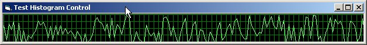



## Histogram Control \(like Windows Task Manager Performance\)

### Description

This control is like Windows Task Manager performance scrollers.

It's pretty simple, so the lack of comments :-( shouldn't be a problem.

The main useful bit is bulding the scroller in a hidden picture box, and using bitblt to move it onto the

UserControl (so we don't have to keep adding to the memory required for the display).

There are a few properties for the colours and grid settings, and the whole thing's runtime resizeable

(though I don't know why you'd want to do that).

Feel free to use/modify/improve etc. this for your own stuff - hope you find it useful!
 
### More Info
 

             |
---                |---
**Submitted On**   |2003-11-12 09:49:02
**By**             |[James Kerr](https://github.com/Planet-Source-Code/PSCIndex/blob/master/ByAuthor/james-kerr.md)
**Level**          |Beginner
**User Rating**    |5.0 (30 globes from 6 users)
**Compatibility**  |VB 5\.0, VB 6\.0
**Category**       |[Custom Controls/ Forms/  Menus](https://github.com/Planet-Source-Code/PSCIndex/blob/master/ByCategory/custom-controls-forms-menus__1-4.md)
**World**          |[Visual Basic](https://github.com/Planet-Source-Code/PSCIndex/blob/master/ByWorld/visual-basic.md)
**Archive File**   |[Histogram\_16711111122003\.zip](https://github.com/Planet-Source-Code/james-kerr-histogram-control-like-windows-task-manager-performance__1-49852/archive/master.zip)

